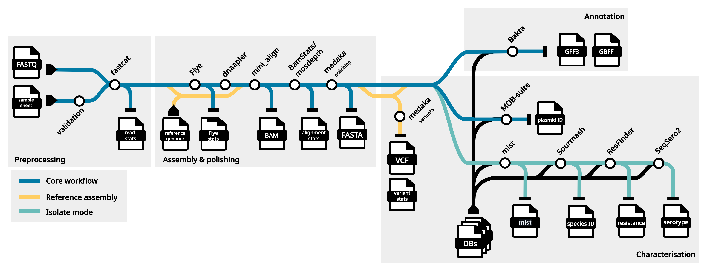

# Bacterial & Fungal Genomes

Assembly, variant calling, and annotation of microbial genomes.


## Introduction

<!---This section of documentation typically contains a list of things the workflow can perform also any other intro.--->

This workflow is used to produce long-read de novo assemblies of bacterial and fungal genomes, or to perform reference-based variant calling.

The workflow also performs analysis of the assemblies, such as species identification, antimicrobial resistance (AMR) analysis, and sequence typing through an optional `--isolates` mode.

In brief, this workflow will perform the following: 

+ De novo (or reference-based) assembly of bacterial and fungal genomes 
+ Variant calling (`--reference` mode only)
+ Annotation of regions of interest within the assembly
+ Identification of plasmid regions within the assembly
+ MLST and genomic similarity based species identification (`--isolates` mode only)
+ Identify genes and SNVs associated with AMR (`--isolates` mode only)

<figure>

<figcaption>Schematic depicting wf-bacterial-genomes workflow.</figcaption>
</figure>


## Compute requirements

Recommended requirements:

+ CPUs = 16
+ Memory = 64GB

Minimum requirements:

+ CPUs = 8
+ Memory = 32GB

Approximate run time: 20-40 minutes per sample with ~50x coverage using minimum requirements

ARM processor support: False


## Install and run


These are instructions to install and run the workflow on command line.
You can also access the workflow via the
[EPI2ME Desktop application](https://labs.epi2me.io/downloads/).

The workflow uses [Nextflow](https://www.nextflow.io/) to manage
compute and software resources,
therefore Nextflow will need to be
installed before attempting to run the workflow.

The workflow can currently be run using either
[Docker](https://docs.docker.com/get-started/)
or [Singularity](https://docs.sylabs.io/guides/3.0/user-guide/index.html)
to provide isolation of the required software.
Both methods are automated out-of-the-box provided
either Docker or Singularity is installed.
This is controlled by the
[`-profile`](https://www.nextflow.io/docs/latest/config.html#config-profiles)
parameter as exemplified below.

It is not required to clone or download the git repository
in order to run the workflow.
More information on running EPI2ME workflows can
be found on our [website](https://labs.epi2me.io/wfindex).

The following command can be used to obtain the workflow.
This will pull the repository in to the assets folder of
Nextflow and provide a list of all parameters
available for the workflow as well as an example command:

```
nextflow run epi2me-labs/wf-bacterial-genomes --help
```
To update a workflow to the latest version on the command line use
the following command:
```
nextflow pull epi2me-labs/wf-bacterial-genomes
```

A demo dataset is provided for testing of the workflow.
It can be downloaded and unpacked using the following commands:
```
wget https://ont-exd-int-s3-euwst1-epi2me-labs.s3.amazonaws.com/wf-bacterial-genomes/wf-bacterial-genomes-demo.tar.gz
tar -xzvf wf-bacterial-genomes-demo.tar.gz
```
The workflow can then be run with the downloaded demo data using:
```
nextflow run epi2me-labs/wf-bacterial-genomes \
	--fastq 'wf-bacterial-genomes-demo/isolates_fastq' \
	--isolates \
	--sample_sheet 'wf-bacterial-genomes-demo/isolates_sample_sheet.csv' \
	-profile standard
```

For further information about running a workflow on
the command line see https://labs.epi2me.io/wfquickstart/


## Related protocols

<!---Hyperlinks to any related protocols that are directly related to this workflow, check the community for any such protocols.--->

This workflow is designed to take input sequences that have been produced from [Oxford Nanopore Technologies](https://nanoporetech.com/) devices.

Optimal DNA extraction will be dependent on the gram status of the organism. Some useful protocols are provided below:
+ [Gram-positive bacteria](https://community.nanoporetech.com/extraction_method_groups/gram-positive-bacterial-gnda)
+ [Gram-negative bacteria](https://community.nanoporetech.com/extraction_methods/gram-ve-dna)
+ [Fungi (yeast)](https://nanoporetech.com/document/extraction-method/yeast-gdna-ont)


Find more related protocols in the [Nanopore community](https://community.nanoporetech.com/docs/).


## Input example

<!---Example of input directory structure, delete and edit as appropriate per workflow.--->
This workflow accepts either FASTQ or BAM files as input.

The FASTQ or BAM input parameters for this workflow accept one of three cases: (i) the path to a single FASTQ or BAM file; (ii) the path to a top-level directory containing FASTQ or BAM files; (iii) the path to a directory containing one level of sub-directories which in turn contain FASTQ or BAM files. In the first and second cases (i and ii), a sample name can be supplied with `--sample`. In the last case (iii), the data is assumed to be multiplexed with the names of the sub-directories as barcodes. In this case, a sample sheet can be provided with `--sample_sheet`.

```
(i)                     (ii)                 (iii)    
input_reads.fastq   ─── input_directory  ─── input_directory
                        ├── reads0.fastq     ├── barcode01
                        └── reads1.fastq     │   ├── reads0.fastq
                                             │   └── reads1.fastq
                                             ├── barcode02
                                             │   ├── reads0.fastq
                                             │   ├── reads1.fastq
                                             │   └── reads2.fastq
                                             └── barcode03
                                              └── reads0.fastq
```


## Pipeline overview

<!---High level numbered list of main steps of the workflow and hyperlink to any tools used. If multiple workflows/different modes perhaps have subheadings and numbered steps. Use nested numbering or bullets where required.--->

### 1. Preprocessing concatenates input files and generate per read stats.

The [fastcat/bamstats](https://github.com/epi2me-labs/fastcat) tool is used to concatenate multifile samples to be processed by the workflow. It will also output per read statistics, such as read length, count and quality statistics.

### 2a. De novo assembly

#### i. Assembly

[Flye](https://github.com/fenderglass/Flye) is used to generate draft assembly from the FASTQ reads. By default, Flye runs with `--nano-hq` parameter. Additional configuration can be specified using `--flye_opts` parameter.

Flye produces a draft assembly along with a statistics file containing information on contig lengths, coverage, multiplicity, and circularity. For de novo assemblies, contigs are assigned random names, whereas in reference-based assemblies, contig names are inherited from the reference sequence.

#### ii. Contig reorientation 

Following de novo assembly, circular contigs are processed with [dnaapler](https://github.com/gbouras13/dnaapler), which reorients contigs to a common start position at the origin of replication: _dnaA_ for chromosomes and _repA_ for plasmids.
Dnaapler relies on MMseqs2-based search against a database consisting of origin of replication sequences.
Information on the database content can be found in the [dnaapler documentation](https://github.com/gbouras13/dnaapler).

#### iii. Alignment

Following contig reorientation, reads are aligned against the assembly using [mini_align](https://github.com/nanoporetech/pomoxis/).
Subsequently, [bamstats](https://github.com/epi2me-labs/fastcat?tab=readme-ov-file#bamstats) and [mosdepth](https://github.com/brentp/mosdepth) are used to calculate mapped read and genome coverage statistics.

#### iv. Polishing

The draft assembly from Flye is then polished using [medaka](https://github.com/nanoporetech/medaka).
This step will attempt to correct any errors that were introduced during the de novo assembly process and generate a FASTA output file.

The workflow selects the appropriate [medaka models](https://github.com/nanoporetech/medaka#models) based on the basecaller configuration that was used to process the signal data.
Per default, the workflow will attempt to determine the basecaller model from the input data.
When this fails (or when you wish to override the automatic selection), it can be provided with `--override_basecaller_cfg`.

### 2b. Variant calling mode

#### i. Align reads

Reads are aligned against the provided reference with [mini_align](https://github.com/nanoporetech/pomoxis/).

#### ii. Call variants

After alignment, haploid variants are called with [medaka](https://github.com/nanoporetech/medaka) (see the Polishing section above for details on Medaka model selection).

#### iii. Use the variants to generate a consensus

The variants passing the depth filter are then incorporated in the reference to create the consensus sequence. Variant stats are also created at this point.

### 3. Plasmid identification

Plasmid identification and characterization is performed using [MOB-suite](https://github.com/phac-nml/mob-suite).
This workflow implements `mob-recon`, which is used to perform plasmid reconstruction and typing.
Contigs are characterized as chromosomal or plasmid.
Plasmid contigs sharing similar replication and mobilization characteristics are grouped into MOB-clusters, representing distinct plasmids that may consist of multiple fragments.

The summary report includes a section listing plasmid contigs and identified characteristics, such as replicon, relaxase, MPF, and _oriT_ typing information, as well as mobility prediction (conjugative, mobilizable, or non-mobilizable), and predicted/observed plasmid host range.
The output directory contains a `{alias}_mob_results` subdirectory, which includes a `mobtyper-results.txt` file with additional characteristics for each contig.
If plasmid contigs are identified, this directory will also contain `.fasta` files grouping plasmid contigs based on MOB-cluster identification, and an additional `mobtyper-results.txt` file with extended typing information.

Plasmid identification can be disabled using the `--run_plasmid_id` parameter.
Additional [mob-recon options](https://github.com/phac-nml/mob-suite) can be specified using the `--plasmid_id_opts` parameter.

### 4. Annotations

Consensus genome assemblies can be annotated using [Bakta](https://github.com/oschwengers/bakta). 
By default, Bakta will run with [light database](https://github.com/oschwengers/bakta?tab=readme-ov-file#database), which will be automatically downloaded and installed when the workflow is executed. To optionally run Bakta with the [full database](https://zenodo.org/records/14916843) specify `--bakta_db_type=full`. This will trigger the installation of the full version of the database. As of version 6.0, the compressed size of the full database is approximately 32 GB, so the download may take a significant amount of time.
Alternatively, users can use following steps to manually download and install Bakta database, and specify the custom database location using the `--bakta_db` parameter.

#### Downloading the full database (via Docker)
A compatible database version can be downloaded using the following command:

```bash
docker run -v /path/to/desired-db-path:/db --entrypoint /bin/bash ontresearch/bakta:latest
 -c "bakta_db download --output /db --type full"
```

#### Manual download

Alternatively, you can manually download the database:
```bash
wget https://zenodo.org/record/14916843/files/db.tar.xz
```

Then install it using Docker:
```bash
docker run -v /path/to/db:/db --entrypoint /bin/bash ontresearch/bakta:latest -c "bakta_db install -i db.tar.xz"
```

#### Updating AMRFinderPlus database
Bakta relies on the AMRFinderPlus database, which may need to be updated manually (even after a fresh installation of the Bakta database). To update it:

```bash
docker run -v /path/to/db:/db --entrypoint /bin/bash ontresearch/bakta:latest -c "amrfinder_update --force_update --database db/amrfinderplus-db/"
```

#### Using a local database in the workflow
To use a locally installed Bakta database, pass the path using `--bakta_db`. For example:

```bash
nextflow run epi2me-labs/wf-bacterial-genomes \
	--fastq '/path/to/fastq' \
	--bakta_db '/path/to/db'
```

By default, the workflow disables circular genome plot generation by Bakta (`--skip-plot`), but all other settings follow Bakta’s defaults. Users can customize Bakta's behavior by supplying additional arguments via `--bakta_opts`.

### 5. Isolates mode (optional)

#### i. Multi-locus sequence typing (MLST)

MLST is a common technique used to help characterise bacterial isolates by using allelic variation from internal DNA fragments of 6-7 housekeeping genes. Typing schemes for specific species and genera are found on [PubMLST](https://pubmlst.org/) and are pre-loaded into this workflow. [MLST](https://github.com/tseemann/mlst) is used to scan assembly and automatically infer the correct typing scheme, and subsequently identify the allele variant found.

MLST results determine the species assignment shown in the final report. This information also determines whether the sample will undergo Salmonella typing or point mutation–based antimicrobial resistance prediction.

#### ii. Species identification

[Sourmash](https://sourmash.readthedocs.io/en/latest/index.html) is used to perform taxonomic identification of assemblies.
Sourmash performs a k-mer based sequence comparison against genomes in a reference database collection.
The analysis uses MinHash sketching to rapidly identify the most similar reference genomes and provide species-level classification with confidence metrics.
Sourmash results provide taxonomic assignment from domain to species level, along with Average Nucleotide Identity (ANI) values and coverage statistics, to assess the quality of the match.
The analysis identifies the primary species match as well as secondary matches that may represent genomic variation within the species.
Species identification complements MLST analysis by providing broader taxonomic context and can help resolve cases where MLST schemes may not be available for the organism.
The isolate HTML report includes the folloiwing subset of `sourmash gather` metrics:

| Metric | Description |
|--------|-------------|
| Match rank | Order of matches ranked by quality (0 = best match) |
| Species call | Taxonomic classification of the reference genome |
| Query containment ANI | Average Nucleotide Identity for the query intersect section |
| Intersect (bp) | Number of base pairs that overlap between query and reference |
| Remaining (bp) | Base pairs in query not explained by previous matches |
| Fraction original query | Proportion of the original query sequence that matches this reference |
| Fraction unique | Proportion of query that uniquely matches this reference (not shared with others) |
| Reference Genome | Identifier and name of the matching reference genome in database |

The full set of `sourmash gather` metrics for all matches with intersect above 25000bp threshold is output as a `{alias}_sourmash_taxonomy.csv` file.

The workflow uses [GTDB R226](https://sourmash.readthedocs.io/en/latest/databases-md/gtdb226.html) bacterial and [NCBI Funal reference](https://sourmash.readthedocs.io/en/latest/databases-md/ncbi_euks_2025_01.html) genome databases.
Sourmash behavior can be further modified by providing an exclusion list via `--sourmash_db_exclude_list` or by modifying the existing exclusion list present in `data\sourmash_db_exclude_list.txt`.
This parameter accepts a text file containing assembly identifiers (GCA_XXXXXXXXX.V or GCF_XXXXXXXXX.V format) to exclude from the reference databases. 
Excluded genomes are filtered out before species identification, allowing for removal of problematic reference sequences.

#### iii. Antimicrobial resistance (AMR) calling

[ResFinder](https://bitbucket.org/genomicepidemiology/resfinder/src/master/) is used to detect the presence of acquired resistance genes in the genomes of all bacterial species.
In addition, a subset of well-characterised species/genera will be further analysed using integrated PointFinder to identify specific resistance-associated SNVs.
The following species/genera are included in PointFinder analysis:

* _Campylobacter spp._ 
* _Enterococcus faecalis_
* _Enterococcus faecium_
* _Escherichia coli_
* _Helicobacter pylori_
* _Klebsiella spp._
* _Mycobacterium tuberculosis_
* _Neisseria gonorrhoeae_
* _Salmonella spp._
* _Staphylococcus aureus_
* _Aspergillus fumigatus_
* _Candida albicans_
* _Candidozyma auris_
* _Nakaseomyces glabratus_
* _Saccharomyces cerevisiae_

For purposes of PointFinder analysis, species/genera for a given assembly will be determined by the results of the MLST or Sourmash analysis.
PointFinder analysis will be selected automatically if applicable for a given species call.
PointFinder behaviour can be additionally modified using `--pointfinder_ignore_indels` and `--pointfinder_ignore_stop_codons` parameters.
The role of these options is further described in the [ResFinder](https://bitbucket.org/genomicepidemiology/resfinder/src/master/) documentation.

Optionally, users can replace the default databases with custom ResFinder and PointFinder databases.
Paths to database files can be provided using `--resfinder_db` and `--pointfinder_db`.
Both databases should be KMA indexed as described in the [ResFinder documentation](https://bitbucket.org/genomicepidemiology/resfinder/src/master/).
Additionally, when using a database with added PointFinder species, users need to provide a CSV file mapping Sourmash species names to PointFinder species names.
The file path can be specified using `--sourmash_pointfinder_mapping`.
This CSV file must contain two columns: 'Sourmash species' and 'PointFinder species'.

For example:

```
Sourmash species,PointFinder species
Klebsiella pneumoniae,klebsiella
Klebsiella aerogenes,klebsiella
Candida albicans,candida_albicans
```

In cases where custom databases are not specified, the workflow will use [ResFinder database](https://bitbucket.org/genomicepidemiology/resfinder_db/src/master/) v2.6.0, [DisinFinder database](https://bitbucket.org/genomicepidemiology/disinfinder_db/src/master/) v2.0.1, and a custom [PointFinder database](https://bitbucket.org/genomicepidemiology/pointfinder_db/src/master/) that has been extended to include fungal mutations.
Fungal AMR detection has been implemented for five key species by using single nucleotide SNVs from [FungAMR DB](https://card.mcmaster.ca/fungamrhome).


#### iv. _Salmonella_ serotyping
Samples identified as salmonella from the MLST step will undergo serotyping and antigenic profile prediction analysis using [SeqSero2](https://github.com/denglab/SeqSero2). The analysis will give predictions on:

* Serotype
* Antigenic profile
* Sub-species identification
* O antigen
* H1 antigen (_fliC_)
* H2 antigen (_fljB_)


## Input parameters

### Input Options

| Nextflow parameter name  | Type | Description | Help | Default |
|--------------------------|------|-------------|------|---------|
| fastq | string | FASTQ files to use in the analysis. | This accepts one of three cases: (i) the path to a single FASTQ file; (ii) the path to a top-level directory containing FASTQ files; (iii) the path to a directory containing one level of sub-directories which in turn contain FASTQ files. In the first and second case, a sample name can be supplied with `--sample`. In the last case, the data is assumed to be multiplexed with the names of the sub-directories as barcodes. In this case, a sample sheet can be provided with `--sample_sheet`. |  |
| bam | string | BAM or unaligned BAM (uBAM) files to use in the analysis. | This accepts one of three cases: (i) the path to a single BAM file; (ii) the path to a top-level directory containing BAM files; (iii) the path to a directory containing one level of sub-directories which in turn contain BAM files. In the first and second case, a sample name can be supplied with `--sample`. In the last case, the data is assumed to be multiplexed with the names of the sub-directories as barcodes. In this case, a sample sheet can be provided with `--sample_sheet`. |  |
| reference_based_assembly | boolean | Enable reference guided assembly instead of de novo assembly. | By default de novo assembly will be performed with Flye. Enable this to instead perform a reference-based consensus. A reference must be provided. | False |
| reference | string | Reference sequence FASTA file. | The reference sequence is used when performing reference-based assembly. |  |
| analyse_unclassified | boolean | Analyse unclassified reads from input directory. By default the workflow will not process reads in the unclassified directory. | If selected and if the input is a multiplex directory the workflow will also process the unclassified directory. | False |


### Sample Options

| Nextflow parameter name  | Type | Description | Help | Default |
|--------------------------|------|-------------|------|---------|
| sample_sheet | string | A CSV file used to map barcodes to sample aliases. The sample sheet can be provided when the input data is a directory containing sub-directories with FASTQ files. | The sample sheet is a CSV file with, minimally, columns named `barcode` and `alias`. Extra columns are allowed. A `type` column is required for certain workflows and should have the following values; `test_sample`, `positive_control`, `negative_control`, `no_template_control`. |  |
| sample | string | A single sample name for non-multiplexed data. Permissible if passing a single .fastq(.gz) file or directory of .fastq(.gz) files. |  |  |


### Isolate options

| Nextflow parameter name  | Type | Description | Help | Default |
|--------------------------|------|-------------|------|---------|
| isolates | boolean | Run the Isolates pipeline on the assembly results if set to True. | Isolates mode adds further analysis options to the workflow such as multi-locus sequence typing and antimicrobial resistance calling, as well as producing single reports for each sample in the run. | True |
| sourmash_db_exclude_list | string | Path to file containing assembly IDs (GCA_/GCF_) to exclude from Sourmash species identification, one per line. | A text file containing assembly identifiers (starting with GCA_ or GCF_) that should be excluded from the sourmash database during species identification. Each line should contain one assembly ID. Invalid entries will be skipped. |  |
| resfinder_threshold | string | Threshold of required identity to report a match between a gene in the ResFinder database and the assembly. Valid interval: 0.00-1.00 | Identity refers to the ratio of base pairs that match between the sequence in your assembly and that of the sequence in the ResFinder database. Increasing the threshold will result in fewer, but more accurate hits against the database. | 0.8 |
| resfinder_coverage | string | Minimum coverage (breadth-of) threshold required to report a match between a gene in the ResFinder database and the assembly. Valid interval: 0.00-1.00 | The amount of an AMR gene that has to be present within the assembly as compared to the reference in the ResFinder database. | 0.6 |
| pointfinder_ignore_indels | boolean | Ignore indels when calling point mutations in PointFinder analysis. | When enabled, PointFinder will skip detection of insertion and deletion mutations that may confer antimicrobial resistance. This is useful when sequencing errors or assembly artifacts might cause false positive indel calls, but may miss genuine resistance-conferring indels. | False |
| pointfinder_ignore_stop_codons | boolean | Ignore stop codons when calling point mutations in PointFinder analysis. | When enabled, PointFinder will not report premature stop codons as resistance mutations. This can be useful to reduce noise from sequencing errors that introduce false stop codons, but may miss genuine resistance mutations that create truncated proteins. | False |
| resfinder_db | string | Path to custom ResFinder database directory. | Override the default ResFinder database with a custom one. This should point to a directory containing the ResFinder database files. If not specified, ResFinder will use its bundled ResFinder database. |  |
| pointfinder_db | string | Path to custom PointFinder database directory. | Override the default PointFinder database with a custom one. This should point to a directory containing the PointFinder database files. If not specified, ResFinder will use its bundled PointFinder database. |  |
| sourmash_pointfinder_mapping | string | CSV file mapping Sourmash species names to PointFinder species names. Must contain 'Sourmash species' and 'PointFinder species' columns. | Optional CSV file to customize the mapping between Sourmash taxonomic classifications and PointFinder species for antimicrobial resistance analysis. If not provided, default mappings will be used. The CSV should have two columns: 'Sourmash species' and 'PointFinder species'. |  |


### Advanced Options

| Nextflow parameter name  | Type | Description | Help | Default |
|--------------------------|------|-------------|------|---------|
| override_basecaller_cfg | string | Override auto-detected basecaller model that processed the signal data; used to select an appropriate Medaka model. | Per default, the workflow tries to determine the basecall model from the input data. This parameter can be used to override the detected value (or to provide a model name if none was found in the inputs). However, users should only do this if they know for certain which model was used as selecting the wrong option might give sub-optimal results. A list of recent models can be found here: https://github.com/nanoporetech/dorado#DNA-models. |  |
| run_bakta | boolean | Run Bakta on consensus sequence | Will provide an output file with a list of annotations for your sequence. Optional because it can take some time. | True |
| bakta_opts | string | Command-line arguments for Bakta | [Command line arguments](https://github.com/oschwengers/bakta#usage) which can be used to alter Bakta output annotation files. |  |
| bakta_db | string | Path to existing Bakta database directory. If not provided, the workflow will download the database. | Provide the path to a Bakta database directory containing both Bakta and AMRFinderPlus databases. If not specified, the workflow will automatically download the database type specified by bakta_db_type. |  |
| bakta_db_type | string | Type of Bakta database to download if bakta_db is not provided. | Choose 'light' for the standard database (~1.3 GB) or 'full' for the complete database (~30 GB). Only used when bakta_db is not specified. | light |
| flye_genome_size | integer | Estimated genome size for de novo assembly in non-SI prefix format (e.g 5000000 for 5 Mb genome) | This setting is used in conjunction with `flye_asm_coverage` to subsample the reads used in the initial disjointig step only; all reads are used in subsequent steps. The values in the two parameters are used to calculate a target yield used to subsample the longest reads in the dataset, see [Flye docs](https://github.com/fenderglass/Flye/blob/flye/docs/USAGE.md#-quick-usage) for more information. *Note* For runs with mixed genome sizes, preference the larger genome size. |  |
| flye_asm_coverage | integer | Target coverage to use for subsampling in de novo assembly | This setting is used in conjunction with `flye_genome_size` to subsample the reads used in the initial disjointig step only; all reads are used in subsequent steps. The values in the two parameters are used to calculate a target yield used to subsample the longest reads in the dataset, see [Flye docs](https://github.com/fenderglass/Flye/blob/flye/docs/USAGE.md#-quick-usage) for more information. |  |
| flye_opts | string | Command-line arguments for flye | [Command line arguments](https://github.com/fenderglass/Flye/blob/flye/docs/USAGE.md#-quick-usage) which can be used to alter the de novo assembly process. Enter the command as quoted string (e.g '--meta --iterations 2'). Flye's `--genome-size` and `--asm-coverage` parameters can be set directly in the workflow with `--flye_genome_size` and `--flye_asm_coverage`, respectively. |  |
| min_read_length | integer | Reads below this threshold will be removed from analysis. |  | 1000 |
| max_coverage_plots | integer | Maximum number of largest contigs for which depth coverage plots will be displayed in the summary report. | When specified, only the N largest contigs (by total length) will be shown in the genome coverage depth plots. Set to 'null' to display all contigs. | 20 |
| run_plasmid_id | boolean | Enable plasmid identification and characterization using MOB-suite. | MOB-suite will identify plasmid sequences in the assembled genomes, reconstruct plasmids, and predict plasmid mobility based on the presence of mobilization and replication genes. Results include plasmid sequences, mobility predictions, and incompatibility group typing. | True |
| plasmid_id_opts | string | Command-line arguments for mob_recon | Additional command-line arguments that can be passed to mob_recon. For example, `--filter_db` to specify custom databases. See [MOB-suite](https://github.com/phac-nml/mob-suite) documentation for available options. |  |


### Output Options

| Nextflow parameter name  | Type | Description | Help | Default |
|--------------------------|------|-------------|------|---------|
| out_dir | string | Directory for output of all workflow results. |  | output |


### Miscellaneous Options

| Nextflow parameter name  | Type | Description | Help | Default |
|--------------------------|------|-------------|------|---------|
| threads | integer | Number of CPU threads. | Provided to alignment, Flye assembly, Dnaapler, aligment, Bakta, and MOB-suite workflow steps to improve performance. | 3 |


## Outputs

Output files may be aggregated including information for all samples or provided per sample. Per-sample files will be prefixed with respective aliases and represented below as {{ alias }}.

| Title | File path | Description | Per sample or aggregated |
|-------|-----------|-------------|--------------------------|
| Workflow report | wf-bacterial-genomes-report.html | Report for all samples. | aggregated |
| Workflow results | results.json | Structured workflow results for internal/onward use. | aggregated |
| Workflow checkpoints | checkpoints.json | Structured workflow checkpoints for internal/onward use. | aggregated |
| Concatenated sequence data | {{ alias }}/seqs.fastq.gz | Per sample reads concatenated in to one fastq file. | per-sample |
| Per file read stats | {{ alias }}/fastcat_stats/per-file-stats.tsv | A TSV with per file read stats. | per-sample |
| Per read stats | {{ alias }}/fastcat_stats/per-read-stats.tsv.gz | A TSV with per read stats. | per-sample |
| Flye assembly stats | {{ alias }}.flye_stats.tsv | Assembly statistics generated for Flye assemblies. | per-sample |
| Alignment | {{ alias }}.bam | Aligned reads for the sample in BAM format. | per-sample |
| Alignment index | {{ alias }}.bam.bai | An index file for the alignment in BAI format. | per-sample |
| Draft assembly FASTA file | {{ alias }}.medaka.fasta.gz | Consensus file generated from either de novo assembly or reference variant calling pipeline, with contigs oriented to start at replication initiation point. | per-sample |
| Plasmid contig identification results | {{ alias }}_mob_results | Complete MOB-suite output directory containing all plasmid identification and characterisation results | per-sample |
| Variants VCF file | {{ alias }}.medaka.vcf.gz | VCF file of variants detected against the provided reference (reference mode only). | per-sample |
| Variants summary | {{ alias }}.variants.stats | TSV file of summary statistics for variants in sample (reference mode only). | per-sample |
| Annotations in GFF3 format | {{ alias }}.bakta.gff3 | Annotations of regions of interest in assembly in GFF3 format. | per-sample |
| Annotations in GBFF format | {{ alias }}.bakta.gbff | Annotations of regions of interest in assembly in GBFF format. | per-sample |
| Sequence typing results | {{ alias }}.mlst.json | Sequence typing results in JSON format (isolates mode only). | per-sample |
| Sourmash taxonomic identification results with lineage annotations. | {{ alias }}_sourmash_taxonomy.csv | Sourmash gather hits with taxonomic lineage annotations (isolates mode only). | per-sample |
| Sourmash excluded assemblies | sourmash_picklist_excluded.txt | List of assembly identifiers (GCA_/GCF_) excluded from default Sourmash species identification database (isolates mode only). | aggregated |
| AMR calling results | {{ alias }}_resfinder_results | Complete AMR calling output directory containing detailed ResFinder, PointFinder, and DesinFinder outputs (isolates mode only). | per-sample |
| Isolate per sample report | {{ alias }}-isolates-report.html | Per sample report (isolates mode only). | per-sample |


## Troubleshooting

<!---Any additional tips.--->
+ If the workflow fails please run it with the demo data set to ensure the workflow itself is working. This will help us determine if the issue is related to the environment, input parameters or a bug.
+ See how to interpret some common nextflow exit codes [here](https://labs.epi2me.io/trouble-shooting/).


## FAQs

<!---Frequently asked questions, pose any known limitations as FAQs.--->

### No results for multi-locus sequence typing?
This usually occurs if the assembly is incomplete and does not have sufficient coverage to identify the house keeping genes of the typing scheme. Another, rarer scenario is if the assembly is from an organism with no typing scheme. A list of the available typing schemes can be found [here](https://github.com/tseemann/mlst/tree/master/db/pubmlst). In both scenarios, AMR calling will still be performed but only for acquired resistance genes.


If your question is not answered here, please report any issues or suggestions on the [github issues](https://github.com/epi2me-labs/wf-bacterial-genomes/issues) page or start a discussion on the [community](https://community.nanoporetech.com/).


## Related blog posts

<!---Any other sections that are relevant specifically to this workflow and may be useful to users eg. ## Related blog posts. ## Learning center links.--->

+ [Importing third-party workflows into EPI2ME Labs](https://labs.epi2me.io/nexflow-for-epi2melabs/)

See the [EPI2ME website](https://labs.epi2me.io/) for lots of other resources and blog posts.


